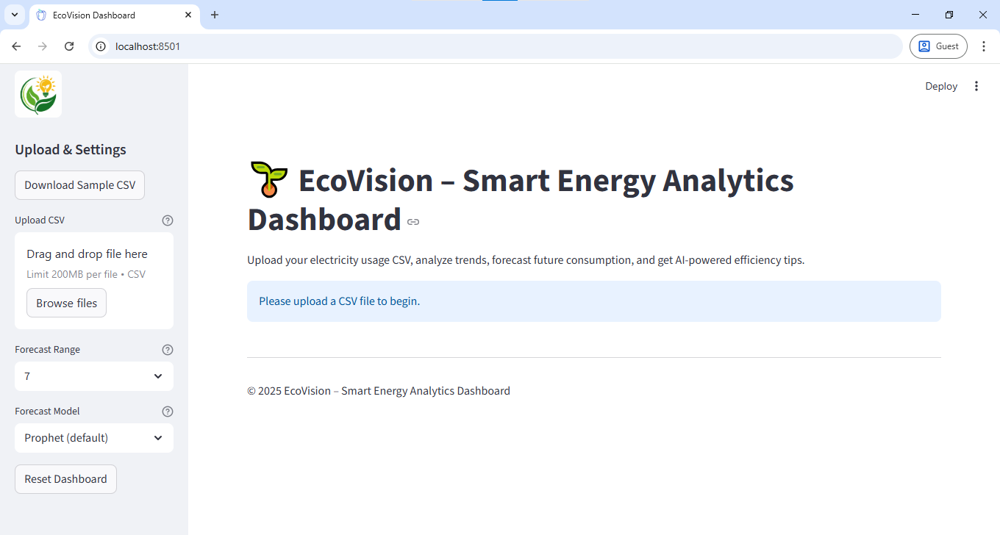
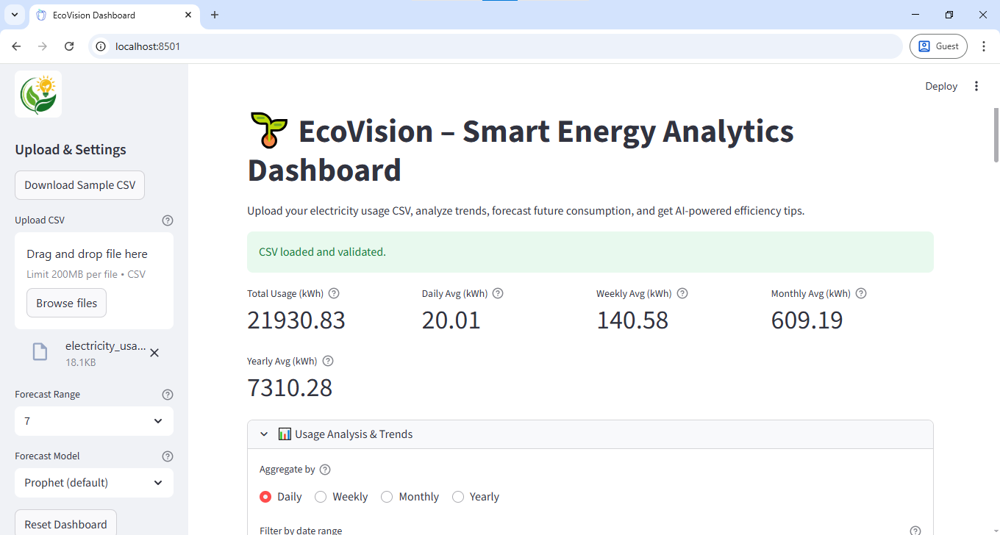
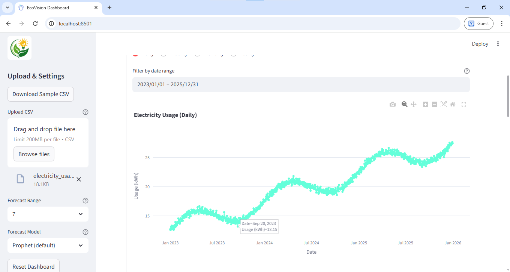
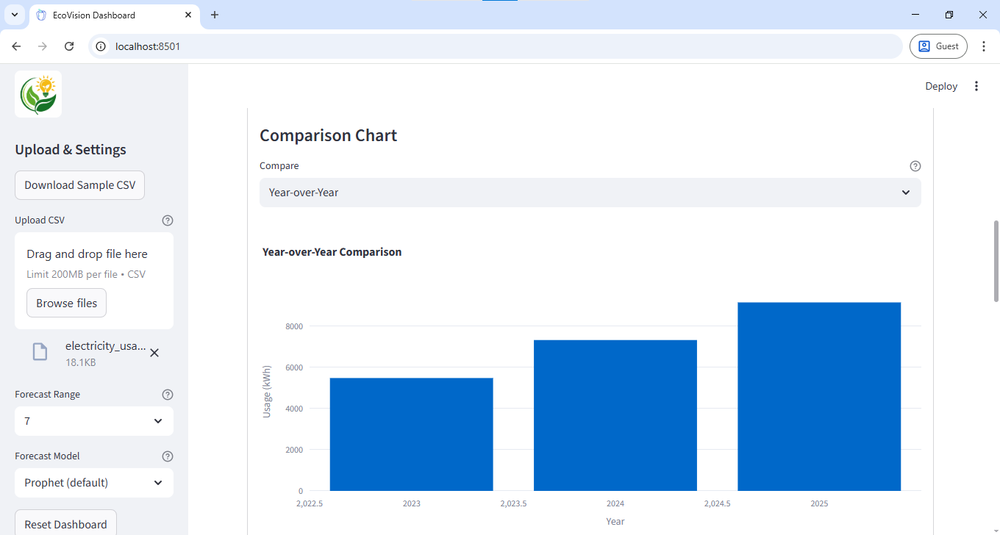
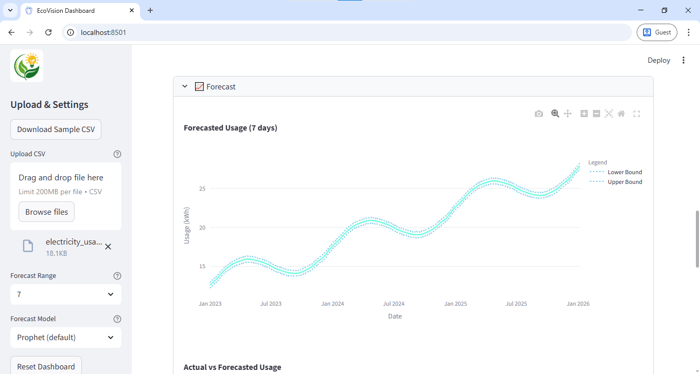
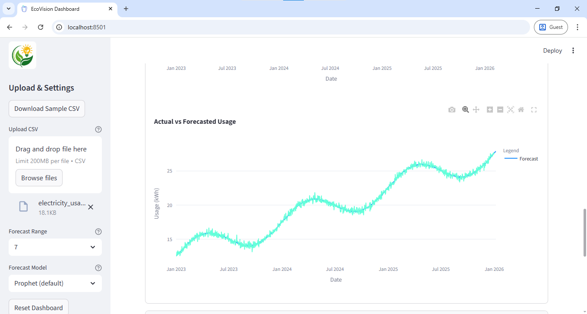
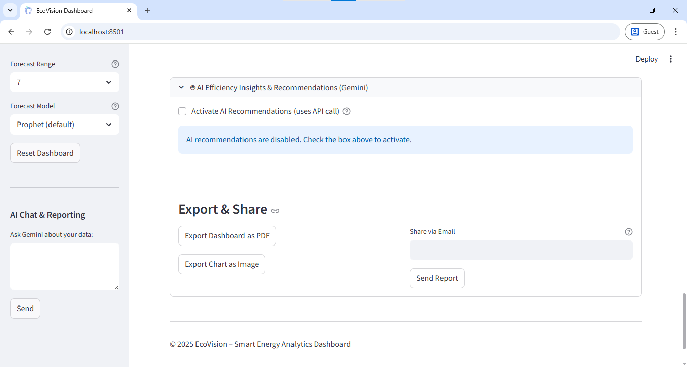

# EcoVision – Smart Energy Analytics Dashboard

EcoVision is a modern, production-ready Streamlit web app for analyzing electricity usage, forecasting future consumption, and generating AI-powered efficiency tips. Upload your CSV, explore interactive charts, and get actionable insights. Designed for real-world energy analytics, business, and research.

---

## 🚀 Features
- **Flexible Data Upload:** Supports any CSV with `date` and `usage_kWh` columns
- **Data Validation & Aggregation:** Daily, weekly, monthly, yearly
- **Key Metrics:** Total, average, peak, and robust daily/weekly/monthly/yearly averages
- **Interactive Visualizations:** Plotly charts, dynamic comparison (year-over-year, month-over-month, etc.)
- **Date Range Filtering:** Analyze any period in your dataset
- **Forecasting:** Prophet-based, 7/30 day predictions
- **AI Insights:** Personalized tips, chat, and trend summaries (Google Gemini API)
- **Sidebar AI Chat:** Ask custom questions about your data
- **Anomaly & Peak Detection:** Identify unusual usage patterns
- **Modern UI/UX:** Custom logo, theme, metric cards, expanders, tooltips, help icons
- **Sample Data:** Realistic CSVs for robust testing
- **Export & Share:** PDF/image/email (upcoming features, UI placeholders included)
- **Large Dataset Optimization:** Lazy loading, AI caching
- **Reset & Download:** Sample CSV download, dashboard reset

---

## 🛠️ Setup
1. **Clone this repo:**
   ```bash
   git clone https://github.com/yourusername/EcoVision.git
   cd EcoVision
   ```
2. **Install requirements:**
   ```bash
   pip install -r requirements.txt
   ```
3. **Add your Gemini API key (securely):**
   - Create a `.env` file and a `.streamlit/secrets.toml` file
   - Add your Gemini API key:
     ```env
     GEMINI_API_KEY="your-key-here"
     ```
   - **Important:** Your API keys and secrets are protected by the included `.gitignore` file and will NOT be pushed to GitHub.
4. **Run the app:**
   ```bash
   streamlit run app.py
   ```
---

## 📊 Sample Data
The dashboard uses a realistic sample CSV: `data/electricity_usage_2023_2025.csv` for testing and demo purposes. You can download it from the sidebar or use your own data in the same format.

---

## 🖼️ Screenshots







---

## 🤝 Contributing
Contributions, issues, and feature requests are welcome! Open an issue or pull request to get started.

---

## 📄 License
This project is licensed under the MIT License.

---

EcoVision is built for real-world analytics, business, and research applications. For questions or feedback, open an issue or contact the maintainer.
